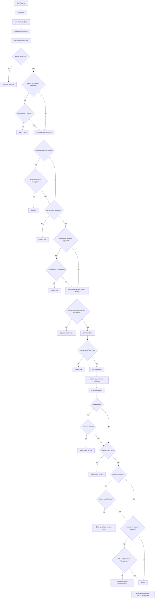

# Human Review Gates in the Workflow

> Vietnamese: workflow-human-review-gates.vi.md

This document defines precisely:

- which gates in the current workflow already have `human review/pass` at source-of-truth level
- which gates should be made mandatory if a stricter `AI proposes, human approves` model is desired
- how the AI-human flow should run to keep the agent from bypassing gates on its own

## Up-Front Conclusion

If you stop at:

- AI drafts artifacts
- human reviews when deemed necessary
- `DoR` and `DoD` have owners

then the workflow is controlled, but not strict enough to guarantee that AI will not push delivery further than the human has actually approved.

To tighten further, six things are required:

1. a clear separation of `what AI may do` and `what authority humans retain`
2. any gate that changes delivery state must be a `human-controlled gate`
3. a human pass must be based on artifact + evidence + clear authority
4. if a human gate has not passed, the workflow must be `BLOCKED` or return to the previous step
5. for `empty/greenfield projects`, a `bootstrap gate` layer must exist before materializing the first work item implementation
6. the implementation path must be locked at the capability-control level until the protocol opens `ACTIVE + s07 + write-root`

## Reading Principles

- `human review/pass` means a real-person role with the requisite authority has reviewed and closed the corresponding gate.
- `self review`, `targeted review`, and `independent review` in `s07` do not automatically imply `human pass`.
- `role_signoffs` is the authority/sign-off layer of a workflow step or work item; it does not automatically replace `waiver authority`.
- `gate_reviews` is the audit-trail layer showing which human reviewed which gate and when.
- `trusted approval receipt` is the enforcement layer showing that a gate has been sealed by a human with a signed receipt outside the project root; gate-review metadata alone is no longer sufficient to open an execution gate.
- If a gate that requires a human pass has not been completed, the work item must be `BLOCKED`, return to the previous step, or stop before advancing to the next gate.
- `work item` and `change package` managed by the protocol must always keep `review_required=true`; there is no `NOT_REQUIRED` path for an approval gate that is being enforced.

## Strict AI-Human Rules

- This workflow should operate on the `AI proposes, human approves` model.
- Before any substantive action on a task in the delivery workflow, AI must go through the entry router `workflow-governance-router` to pin down the current step, delivery context, missing gates, and next human action.
- `approve` may still go through the `CLI`, but it must be a `human-operated CLI`, not an `agent-accessible approval`.
- AI is allowed to:
  - analyze, clarify, draft artifacts, prepare option analysis
  - propose technical approach, task plan, review findings, and verify recommendation
  - implement, run tests, aggregate evidence, and state a recommendation
- AI must not, on its own:
  - approve a work item or change package
  - pass `Spec`
  - pass `Contract`
  - pass `DoR`
  - pass `Approach`
  - pass `Foundation Decision`
  - pass `Task Plan`
  - pass `UAT`
  - pass `DoD`
  - pass `Release`
  - pass `Business Acceptance`
  - approve an `exception` or `waiver` when authority belongs to a different human role
- Every human-controlled gate must have:
  - the step or protocol artifact as source-of-truth
  - sufficient evidence for the reviewer to inspect
  - an owner or approver with the correct authority
- `legacy scaffold` without a `.work-item-report.json` must not be treated as execution-ready by default; the bundle's strict default is `protocolControl.legacyScaffoldPolicy=forbid`.
- A human pass must be explicit:
  - it must not be inferred from a comment, a technical `review pass`, a local `test pass`, the mere existence of an artifact, or metadata in a note
- A human pass must be an interactive action:
  - normal mode must not accept `--approval-passphrase`
  - normal mode must not accept `WORKFLOW_BUNDLE_APPROVAL_PASSPHRASE`
  - the approve command must run in a human-controlled TTY
  - non-interactive approval is reserved for smoke/test fixtures
- If a human gate has not passed:
  - do not advance to the next gate
  - do not activate status or declare `done`
  - must be `BLOCKED` or return to the previous step
- `ACTIVE` is an execution gate, no longer purely an authoring gate; under the current protocol, authoring for `s01-s06` may occur while a work item is scaffolded but not yet `ACTIVE`.
- The implementation path should be treated as locked at the capability-control level until the work item is `ACTIVE` at `s07` and a `write-root` has been granted.
- Generic coding defaults such as "feature request => code", "user wants code changes by default", "do not stop at analysis", or "end-to-end by default" are not gate approvals; if `Missing Gates` remain, AI must return a status block and stop before code/scaffold.

## Router-First Status Reporting

Before diving into authoring or execution of a work item, AI should report at minimum the following status block:

```text
Current Step: s0X <step name>
Workflow Status: ACTIVE | BLOCKED | WAITING_APPROVAL | READY_FOR_REVIEW | VERIFIED
Delivery Context: greenfield | brownfield
What I Am Doing Now: <one sentence>
Missing Gates: <list or NONE>
Next Artifact: <next artifact or decision needed>
Next Human Action: <review/approval needed from a human, or NONE>
```

Rules for reading this block:

- `Current Step` indicates where AI stands in the `s01 -> s08` chain; it must not be implicitly inferred.
- `Workflow Status` must be explicit; if a gate or significant blocker is still missing, use `BLOCKED` or `WAITING_APPROVAL`.
- `Missing Gates` is the quick-view layer showing humans why AI is not yet allowed to implement.
- `Next Human Action` is the specific review, approval, or confirmation action required from a human, avoiding ambiguity between technical review and a gate pass.
- if `Missing Gates` is not `NONE`, `Workflow Status` must not be `ACTIVE`, `READY_FOR_REVIEW`, or `VERIFIED`.
- if `Missing Gates` is not `NONE`, `Next Human Action` must not be `NONE`.

## Existing Repo Baseline

These are the gates that already have a clear source-of-truth in the current repo:

| Gate | Location | Default human owner | Status |
|---|---|---|---|
| `spec` | `s04 Acceptance + DoR` | `po`, `ba` | required |
| `contract` | `s04 Acceptance + DoR` when scope touches `API contract` or `UX contract` | `designer`, `developer`; add `po` when the contract touches a business rule | required if scope demands it |
| `work item approval` | before `ACTIVE` | reviewer designated via `wfc work-item approve --reviewed-by <role>` | required; protocol-managed items are always `review_required=true` |
| `dor` | `s04 Acceptance + DoR` | `po`, `ba` | required |
| `approach` | `s05 Technical Approach` | `developer` | clear owner sign-off |
| `foundation` | `s05 Technical Approach` when scope touches `solution class`, `stack`, `runtime`, `deployment model` | `developer`; add `designer`/`devops` depending on surface | required if scope demands it |
| `task_plan` | `s06 Task Plan` | `developer`; add `qc`/`devops` when verify or release impact is significant | required |
| `uat` | `s08 Verify + DoD` when scope needs `UAT` or business-scenario validation | `qc`, `po`; add `designer` when UX validation is the main gate | required if scope demands it |
| `dod` | `s08 Verify + DoD` | `qc` | required |
| `release` | `s08 Verify + DoD` when scope touches release | `qc`, `devops` | required if scope demands it |
| `business_acceptance` | `s08 Verify + DoD` when scope touches business acceptance | `po` | required if scope demands it |
| `exception/waiver approval` | any step with a deviation | per `governance-role-model` | required if an exception exists |

## Recommended Strict AI-Human Regime

If you want AI-human tighter than the baseline, treat the gates below as `MUST human pass`:

| Gate | Step or state | Default human owner | When you may proceed |
|---|---|---|---|
| `Spec pass` | `s04` | `po`, `ba` | only after the requirement/spec baseline has been human-approved |
| `Contract pass` | `s04` when scope touches `API contract` or `UX contract` | `designer`, `developer`; add `po` when the contract touches a business rule | only after the contract baseline has been human-approved or explicitly marked `not_applicable` |
| `work item approval` | `MATERIALIZED -> ACTIVE` | designated reviewer | only after the work item has been approved; `ACTIVE` opens only when the required step-gate evidence is also ready |
| `DoR pass` | `s04` | `po`, `ba`; add `qc` when testability is the main risk; add `designer` when a UX rule drives readiness | only after requirement, AC, readiness, and governance checks are clear |
| `Approach pass` | `s05` | `developer`; add `designer` or `devops` when scope touches UX/runtime/release | only after `2-3` options, trade-offs, and a recommendation have been human-approved |
| `Foundation pass` | `s05` when scope touches `solution class`, `stack`, `runtime`, `deployment model` | `developer`; add `designer`/`devops` as needed | only after a human selects the final foundation decision |
| `Task Plan pass` | `s06` | `developer`; add `qc`/`devops` when verify or release impact is significant | only after the task plan is execution-oriented and free of placeholders |
| `UAT pass` | `s08` when scope requires it | `qc`, `po`; add `designer` when UX validation is the main gate | only after verify/UAT results match the approved spec and contract |
| `DoD pass` | `s08` | `qc` | only after evidence, checklist, review findings, and residual risk have been concluded |
| `Release pass` | `s08` | `qc`, `devops` | only when scope has a packaging/runtime/release lane |
| `Business Acceptance pass` | `s08` | `po` | only when scope needs a final business sign-off |
| `Exception/Waiver pass` | the step where the deviation arises | per the authority matrix | only after the correct authority has approved |

## Practical Interpretation

To keep AI and human roles from blurring, understand it as follows:

- AI may analyze, propose, draft artifacts, prepare evidence, perform technical review, and state recommendations.
- Humans retain the right to pass or fail the gates that change delivery state.
- AI must not self-declare `review pass`, `test pass`, `spec clear enough`, `task plan clear enough`, or `done`.
- A human pass here is the authority to close a gate, not just a comment for reference.

## Contract Output Before Each Gate

| Gate | AI must deliver | Human must check | Pass allowed when |
|---|---|---|---|
| `Spec pass` | requirement/spec baseline, scope, non-goals, approved spec refs or baseline note | is the spec clear, aligned with business intent, and traceable enough to serve as source-of-truth? | `Spec` is explicitly closed |
| `Contract pass` | API contract draft, UX contract draft, interaction rule, N/A note if not applicable | does the contract match user-facing expectations, boundaries, and behavior? | `Contract` is explicitly closed or `not_applicable` is confirmed by a human |
| `work item approval` | materialization report, scope draft, slug, change strategy | should the work item open, is it a duplicate, is the boundary correct? | human reviewer approves the work item or change |
| `DoR pass` | measurable AC, resolved open questions, governance checks, readiness note | is the requirement clear enough, is testability sufficient, are there business/governance blockers? | `DoR` is explicitly closed |
| `Approach pass` | `2-3` options, trade-offs, recommendation, technical approach draft, boundary, exception if any | is this direction on-scope, small enough, correct enough, and is the recommendation worth choosing? | `Approach` is explicitly closed |
| `Foundation pass` | recommended solution class, stack, runtime, deployment model | does the final foundation decision fit the target system and constraints? | a human selects the final foundation decision |
| `Task Plan pass` | execution-oriented task plan, verify path, dependencies, checkpoints | is the plan clear enough to execute and review, are there placeholders? | the `s06` reviewer confirms the plan is executable |
| `UAT pass` | verify summary, scenario evidence, approved-spec comparison, contract comparison | do the actual results match the approved spec and approved contract? | `UAT` is concluded |
| `DoD pass` | evidence pack, review findings, test summary, residual risks, compliance verdict | is the evidence strong, are findings closed, is residual risk acceptable? | `DoD` is concluded |
| `Release pass` | rollout note, smoke/rollback plan, release evidence | are there enough conditions to ship and roll back? | `release` is concluded |
| `Business Acceptance pass` | outcome vs `BRD/SRS`, user/business impact note | does the result match business intent? | `business_acceptance` is concluded |
| `Exception/Waiver pass` | exception artifact, reason, impact, mitigation, owner | is the authority correct, is mitigation sufficient, is a co-approver needed? | `approved_by` is valid and the state is closed |

## How a Gate Is Recorded

- `work item approval` is recorded via a protocol command such as `wfc work-item approve`.
- `spec`, `contract`, `dor`, `approach`, `foundation`, `task_plan`, `uat`, `release`, `business_acceptance`, `dod` should trace the owner via `role_signoffs`.
- The human pass for each gate should be traced directly via `gate_reviews`, at minimum including `*_reviewed_by` and `*_reviewed_at`.
- `exception/waiver approval` must use a `governance-exception` artifact with `approved_by` matching the correct authority.

## Required Gates per Step

| Step | What AI does | What a human must pass |
|---|---|---|
| `materialization` | propose work item or change package | approve work item or change before activation; `ACTIVE` opens only after approval + evidence for `s04-s06` |
| `s01-s03` | clarify, business goal, open questions, gather blockers | no formal gate pass yet, but if context remains vague you must not push to later gates |
| `s04` | draft requirement/spec baseline, contract baseline if any, AC, DoR, governance checks | pass `Spec`; if applicable, pass `Contract`; pass `DoR` |
| `s05` | draft `2-3` options, technical approach, boundary, foundation decision if any | pass `Approach`; if applicable, pass `Foundation` |
| `s06` | draft task plan, verify path, checkpoints | pass `Task Plan` |
| `s07` | implement, test, review early, prepare evidence | do not close the final delivery gate at this step |
| `s08` | aggregate evidence, verify, UAT draft if any, DoD draft, release recommendation | if applicable, pass `UAT`; pass `Release`; pass `Business Acceptance`; pass `DoD` |

## Rules Specific to Empty Project / Greenfield

If the project is empty or has no approved baseline, you must tighten beyond the usual baseline:

- AI may only stop at the `proposal stage`; it must not jump to the `implementation stage` on its own.
- If `delivery_context` is not passed explicitly, the tool must infer from the repo's actual baseline; an empty repo or one with no implementation baseline defaults to `greenfield`.
- `static site`, SPA, SSR, backend-first, CMS, framework, runtime model, deploy model, or CI/CD baseline are `foundation decision`s, not minor implementation details.
- A `foundation decision` must be explicitly human-reviewed at `s05 Approach pass`.
- `s06 Task Plan pass` is valid only after `s05` has closed the foundation decision.
- Without `Approach pass` and `Task Plan pass`, you must not scaffold a framework, dependency tree, Dockerfile, CI/CD, or the first production code.
- A greenfield request such as `QR Voucher`, with UI, a voucher service API, and a brand visual tone, must still stop at the `proposal stage`; it must not select a stack, scaffold an app, or generate code on its own.

The strict flow for `empty/greenfield projects` should be understood as:

1. raw request
2. requirement/spec draft
3. human pass `Spec`
4. API contract or UX contract draft
5. human pass `Contract` or mark `not_applicable`
6. option analysis for solution class or stack
7. human pass `Approach`
8. if a foundation decision exists, human pass `Foundation`
9. task plan or work-item breakdown
10. human pass `Task Plan`
11. only then may you materialize the first work item implementation or implement

## Rules Specific to Brownfield

If the project already has a running baseline, tighten along a different axis than `greenfield`:

- `delivery_context=brownfield` means the existing system is the baseline; do not behave as if the repo is empty.
- `Foundation Decision` is not a default gate for `brownfield`; it opens only when a change actually touches the architectural baseline.
- `brownfield` must have its own per-step output:
  - `s04`: `Existing System Baseline`
  - `s05`: `Brownfield Impact Analysis`
  - `s06`: `Brownfield Delivery Plan`
  - `s08`: `Regression & Compatibility Summary`
- `brownfield` verify and UAT must compare against both the approved spec and the impact on the existing baseline.

The strict flow for `brownfield` should be understood as:

1. raw request
2. requirement/spec draft + existing system baseline
3. human pass `Spec`
4. contract draft if the change touches `API contract` or `UX contract`
5. human pass `Contract` or mark `not_applicable`
6. option analysis for the smallest delta on the existing path
7. human pass `Approach`
8. pass `Foundation` only if the change truly touches the architectural baseline
9. task plan + regression/compatibility checkpoints
10. human pass `Task Plan`
11. implement
12. verify regression/compatibility, UAT if any, then `DoD`

## Default Authority per Gate

| Gate | Default owner | Common extensions |
|---|---|---|
| `spec` | `po`, `ba` | `designer` when UX outcome is the main baseline |
| `contract` | `designer`, `developer` | `po` when the contract touches a business rule; `qc` when testability is the main gate |
| `dor` | `po`, `ba` | `designer` when UX is the readiness gate; `qc` when testability is the main risk |
| `approach` | `developer` | `designer` when it touches an interaction/visual contract; `devops` when it touches runtime/pipeline/rollout |
| `foundation` | `developer` | `designer` when solution class touches the UX shell; `devops` when runtime/deploy is the main decision |
| `task plan pass` | `developer` | `qc` when verify coverage is a risk; `devops` when release/deploy task is critical |
| `uat` | `qc`, `po` | `designer` when UX acceptance is the main gate |
| `dod` | `qc` | `developer` or `devops` only support evidence/remediation; they do not replace the final verify owner |
| `release` | `qc`, `devops` | `developer` when risk lies in migration/code path |
| `business_acceptance` | `po` | `ba` and `designer` only review/support |
| `waiver business` | `po` | `ba` |
| `waiver technical` | `developer` | `qc`; add `po` if there is a business trade-off |
| `waiver runtime/release` | `devops` | `qc`; add `developer` if the code path is involved |

## Flowchart

The flow below is the recommended `strict AI-human gate` version:



## Short Conclusion

If you want AI-human to be truly strict, the canonical gates should be:

1. `Spec pass`
2. `Contract pass` when scope requires it
3. `Approach pass`
4. `Foundation pass` when scope requires it
5. `work item approval`
6. `Task Plan pass`
7. `UAT pass` when scope requires it
8. `DoD pass`
9. `Release pass` when scope requires it
10. `Business Acceptance pass` when scope requires it
11. `Exception/Waiver approval` as soon as a deviation arises

## References

- `README.md`
- `skills/orchestration/codex-workflow-chain/references/work-item-protocol.md`
- `skills/orchestration/codex-workflow-chain/references/workflow-chain.md`
- `project-context/governance-role-model.md`