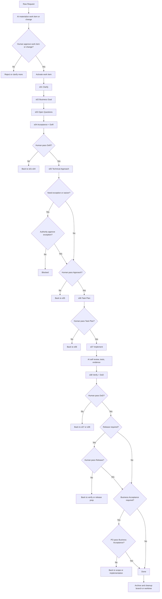

# Human Review Gates Trong Workflow

Tài liệu này chốt rõ:

- gate nào trong workflow hiện tại đã có `human review/pass` ở mức source-of-truth
- gate nào nên được nâng thành bắt buộc nếu muốn mô hình `AI proposes, human approves` chặt hơn
- flow AI-human nên đi như thế nào để tránh agent tự vượt gate

## Kết Luận Trước

Nếu chỉ dừng ở mức:

- AI draft artifact
- human review khi thấy cần
- `DoR` và `DoD` có owner

thì workflow đã có kiểm soát, nhưng chưa đủ chặt để đảm bảo AI không tự đẩy delivery đi xa hơn mức human thực sự đã chấp thuận.

Muốn chặt hơn, cần thêm 4 điều:

1. phân định rõ `AI được làm gì` và `human giữ quyền gì`
2. gate nào làm đổi trạng thái delivery thì phải là `human-controlled gate`
3. human pass phải dựa trên artifact + evidence + authority rõ
4. nếu gate human chưa pass thì workflow phải `BLOCKED` hoặc quay lại step trước

## Nguyên Tắc Đọc

- `human review/pass` nghĩa là một role người thật có authority đã review và chốt gate tương ứng.
- `self review`, `targeted review`, `independent review` trong `s07` không tự động đồng nghĩa `human pass`.
- `role_signoffs` là lớp authority/signoff của workflow step hoặc work item; nó không tự động thay cho `waiver authority`.
- `gate_reviews` là lớp audit trail cho biết human nào đã review gate và review lúc nào.
- Nếu gate yêu cầu human pass chưa hoàn tất, work item phải `BLOCKED`, quay lại step trước, hoặc dừng trước khi sang gate tiếp theo.

## Rule Chặt AI-Human

- Workflow này nên vận hành theo model `AI proposes, human approves`.
- AI được quyền:
  - phân tích, clarify, draft artifact, chuẩn bị option analysis
  - đề xuất technical approach, task plan, review findings và verify recommendation
  - implement, chạy test, tổng hợp evidence, nêu recommendation
- AI không được tự:
  - approve work item hoặc change package
  - pass `DoR`
  - pass `Approach`
  - pass `Task Plan`
  - pass `DoD`
  - pass `Release`
  - pass `Business Acceptance`
  - approve `exception` hoặc `waiver` nếu authority thuộc human role khác
- Mọi human-controlled gate phải có đủ:
  - artifact step hoặc protocol là source-of-truth
  - evidence đủ để reviewer kiểm
  - owner hoặc approver đúng authority
- Human pass phải explicit:
  - không suy diễn từ comment, `review pass` kỹ thuật, `test pass` cục bộ, hay việc artifact đã tồn tại
- Nếu gate human chưa pass:
  - không được sang gate tiếp theo
  - không được activate status hoặc declare `done`
  - phải `BLOCKED` hoặc quay lại step trước

## Baseline Hiện Có Của Repo

Đây là các gate đã có source-of-truth rõ trong repo hiện tại:

| Gate | Vị trí | Human owner mặc định | Trạng thái |
|---|---|---|---|
| `work item approval` | trước `ACTIVE` | reviewer được chỉ định qua `wfc work-item approve --reviewed-by <role>` | bắt buộc |
| `dor` | `s04 Acceptance + DoR` | `po`, `ba` | bắt buộc |
| `approach` | `s05 Technical Approach` | `developer` | có owner signoff rõ |
| `task_plan` | `s06 Task Plan` | `developer`; thêm `qc`/`devops` khi verify hoặc release impact đáng kể | bắt buộc |
| `dod` | `s08 Verify + DoD` | `qc` | bắt buộc |
| `release` | sau `s08` khi scope chạm release | `qc`, `devops` | bắt buộc nếu scope yêu cầu |
| `business_acceptance` | sau `s08` khi scope chạm business acceptance | `po` | bắt buộc nếu scope yêu cầu |
| `exception/waiver approval` | bất kỳ step nào có lệch chuẩn | theo `governance-role-model` | bắt buộc nếu có exception |

## Chế Độ Chặt AI-Human Khuyến Nghị

Nếu muốn siết chặt AI-human hơn baseline, nên coi các gate dưới đây là `MUST human pass`:

| Gate | Step hoặc state | Human owner mặc định | Khi nào được đi tiếp |
|---|---|---|---|
| `work item approval` | `PROPOSED -> ACTIVE` | reviewer được chỉ định | chỉ sau khi work item đã được approve và activate |
| `DoR pass` | `s04` | `po`, `ba`; thêm `qc` khi testability là risk chính; thêm `designer` khi UX rule quyết định readiness | chỉ sau khi requirement, AC, readiness và governance checks đã rõ |
| `Approach pass` | `s05` | `developer`; thêm `designer` hoặc `devops` khi scope chạm UX/runtime/release | chỉ sau khi technical approach được human chốt |
| `Task Plan pass` | `s06` | `developer`; thêm `qc`/`devops` khi verify hoặc release impact đáng kể | chỉ sau khi task plan đủ execution-oriented và không còn placeholder |
| `DoD pass` | `s08` | `qc` | chỉ sau khi evidence, checklist, review findings và residual risk đã được kết luận |
| `Release pass` | sau `s08` | `qc`, `devops` | chỉ khi scope có packaging/runtime/release lane |
| `Business Acceptance pass` | sau `s08` | `po` | chỉ khi scope cần business signoff cuối |
| `Exception/Waiver pass` | step phát sinh lệch chuẩn | theo authority matrix | chỉ sau khi authority đúng đã approve |

## Cách Hiểu Thực Dụng

Để AI và human không nhập nhằng trách nhiệm, nên hiểu như sau:

- AI được quyền phân tích, đề xuất, draft artifact, chuẩn bị evidence, review kỹ thuật và nêu recommendation.
- Human giữ quyền pass hoặc fail các gate làm thay đổi trạng thái delivery.
- AI không được tự coi `review pass`, `test pass`, `spec đủ rõ`, `task plan đủ rõ` hay `done`.
- Human pass ở đây là quyền đóng gate, không phải chỉ để lại comment tham khảo.

## Contract Output Trước Mỗi Gate

| Gate | AI phải giao | Human phải kiểm | Chỉ được pass khi |
|---|---|---|---|
| `work item approval` | materialization report, scope draft, slug, change strategy | work item có nên mở không, có trùng không, có đúng boundary không | human reviewer approve work item hoặc change |
| `DoR pass` | AC đo được, open questions đã xử lý, governance checks, readiness note | requirement đã đủ rõ chưa, testability đã đủ chưa, còn blocker business/governance không | `DoR` được chốt rõ |
| `Approach pass` | option analysis, recommended option, technical approach, boundary, exception nếu có | hướng này có đúng scope, đủ nhỏ, đủ đúng, và không lệch rule chưa được approve không | `Approach` được chốt rõ |
| `Task Plan pass` | task plan execution-oriented, verify path, dependency, checkpoint | plan có đủ rõ để thi công và review không, còn placeholder không | reviewer của `s06` chốt plan đủ thi công |
| `DoD pass` | evidence pack, review findings, test summary, residual risks, compliance verdict | evidence có đủ mạnh không, findings đã đóng chưa, residual risk có chấp nhận được không | `DoD` được kết luận |
| `Release pass` | rollout note, smoke/rollback plan, release evidence | có đủ điều kiện ship và rollback không | `release` được kết luận |
| `Business Acceptance pass` | outcome so với `BRD/SRS`, user/business impact note | kết quả có đúng business intent không | `business_acceptance` được kết luận |
| `Exception/Waiver pass` | exception artifact, lý do, impact, mitigation, owner | authority đúng chưa, mitigation đủ chưa, có cần co-approver không | `approved_by` hợp lệ và state được chốt |

## Cách Ghi Nhận Gate

- `work item approval` được ghi qua protocol command như `wfc work-item approve`.
- `dor`, `approach`, `task_plan`, `release`, `business_acceptance`, `dod` nên trace owner qua `role_signoffs`.
- Human pass của từng gate nên trace trực tiếp qua `gate_reviews`, tối thiểu gồm `*_reviewed_by` và `*_reviewed_at`.
- `exception/waiver approval` phải dùng artifact `governance-exception` với `approved_by` đúng authority.

## Gate Bắt Buộc Theo Step

| Step | AI làm gì | Human phải pass gì |
|---|---|---|
| `materialization` | đề xuất work item hoặc change package | approve work item hoặc change trước khi activate |
| `s01-s03` | clarify, business goal, open questions, gom blocker | chưa có gate pass chính thức, nhưng nếu context còn mơ hồ thì không được đẩy sang gate sau |
| `s04` | draft AC, DoR, governance checks | pass `DoR` |
| `s05` | draft option analysis, technical approach, boundary | pass `Approach` |
| `s06` | draft task plan, verify path, checkpoint | pass `Task Plan` |
| `s07` | implement, test, review sớm, chuẩn bị evidence | không đóng gate delivery cuối ở step này |
| `s08` | tổng hợp evidence, verify, DoD draft, release recommendation | pass `DoD`; nếu có thì pass thêm `Release` và `Business Acceptance` |

## Authority Mặc Định Theo Gate

| Gate | Owner mặc định | Mở rộng thường gặp |
|---|---|---|
| `dor` | `po`, `ba` | `designer` khi UX là readiness gate; `qc` khi testability là risk chính |
| `approach` | `developer` | `designer` khi chạm interaction/visual contract; `devops` khi chạm runtime/pipeline/rollout |
| `task plan pass` | `developer` | `qc` khi verify coverage là risk; `devops` khi release/deploy task là critical |
| `dod` | `qc` | `developer` hoặc `devops` chỉ hỗ trợ evidence/remediation, không thay owner verify cuối |
| `release` | `qc`, `devops` | `developer` khi risk nằm ở migration/code path |
| `business_acceptance` | `po` | `ba` và `designer` chỉ review/support |
| `waiver business` | `po` | `ba` |
| `waiver technical` | `developer` | `qc`; thêm `po` nếu có business trade-off |
| `waiver runtime/release` | `devops` | `qc`; thêm `developer` nếu code path liên quan |

## Flowchart

Flow dưới đây là bản `strict AI-human gate` khuyến nghị:

## Kết Luận Ngắn

Nếu anh muốn AI-human thật chặt, canonical gate nên là:

1. `work item approval`
2. `DoR pass`
3. `Approach pass`
4. `Task Plan pass`
5. `DoD pass`
6. `Release pass` khi scope yêu cầu
7. `Business Acceptance pass` khi scope yêu cầu
8. `Exception/Waiver approval` ngay khi phát sinh lệch chuẩn

## Nguồn Tham Chiếu

- `README.md`
- `skills/orchestration/codex-workflow-chain/references/work-item-protocol.md`
- `skills/orchestration/codex-workflow-chain/references/workflow-chain.md`
- `project-context/governance-role-model.md`
