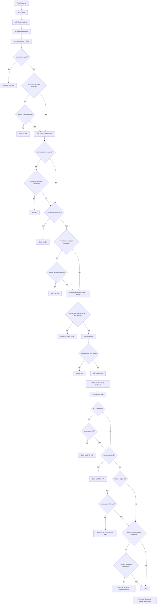

# Human Review Gates Trong Workflow

Tài liệu này chốt rõ:

- gate nào trong workflow hiện tại đã có `human review/pass` ở mức source-of-truth
- gate nào nên được nâng thành bắt buộc nếu muốn mô hình `AI proposes, human approves` chặt hơn
- flow AI-human nên đi như thế nào để tránh agent tự vượt gate

## Kết Luận Trước

Nếu chỉ dừng ở mức:

- AI draft artifact
- human review khi thấy cần
- `DoR` và `DoD` có owner

thì workflow đã có kiểm soát, nhưng chưa đủ chặt để đảm bảo AI không tự đẩy delivery đi xa hơn mức human thực sự đã chấp thuận.

Muốn chặt hơn, cần thêm 6 điều:

1. phân định rõ `AI được làm gì` và `human giữ quyền gì`
2. gate nào làm đổi trạng thái delivery thì phải là `human-controlled gate`
3. human pass phải dựa trên artifact + evidence + authority rõ
4. nếu gate human chưa pass thì workflow phải `BLOCKED` hoặc quay lại step trước
5. với `empty/greenfield project`, phải có lớp `bootstrap gate` trước khi materialize work item implementation đầu tiên
6. implementation path phải bị khóa ở mức capability control cho tới khi protocol mở `ACTIVE + s07 + write-root`

## Nguyên Tắc Đọc

- `human review/pass` nghĩa là một role người thật có authority đã review và chốt gate tương ứng.
- `self review`, `targeted review`, `independent review` trong `s07` không tự động đồng nghĩa `human pass`.
- `role_signoffs` là lớp authority/signoff của workflow step hoặc work item; nó không tự động thay cho `waiver authority`.
- `gate_reviews` là lớp audit trail cho biết human nào đã review gate và review lúc nào.
- `trusted approval receipt` là lớp enforcement cho biết gate đã được human seal bằng signed receipt ngoài project root; gate review metadata một mình không còn đủ để mở execution gate.
- Nếu gate yêu cầu human pass chưa hoàn tất, work item phải `BLOCKED`, quay lại step trước, hoặc dừng trước khi sang gate tiếp theo.
- `work item` và `change package` do protocol quản lý luôn phải giữ `review_required=true`; không có đường `NOT_REQUIRED` cho approval gate đang được enforce.

## Rule Chặt AI-Human

- Workflow này nên vận hành theo model `AI proposes, human approves`.
- Trước mọi hành động substantive trên task thuộc delivery workflow, AI phải đi qua entry router `workflow-governance-router` để chốt current step, delivery context, missing gates và next human action.
- `approve` có thể vẫn đi qua `CLI`, nhưng phải là `human-operated CLI`, không phải `agent-accessible approval`.
- AI được quyền:
  - phân tích, clarify, draft artifact, chuẩn bị option analysis
  - đề xuất technical approach, task plan, review findings và verify recommendation
  - implement, chạy test, tổng hợp evidence, nêu recommendation
- AI không được tự:
  - approve work item hoặc change package
  - pass `Spec`
  - pass `Contract`
  - pass `DoR`
  - pass `Approach`
  - pass `Foundation Decision`
  - pass `Task Plan`
  - pass `UAT`
  - pass `DoD`
  - pass `Release`
  - pass `Business Acceptance`
  - approve `exception` hoặc `waiver` nếu authority thuộc human role khác
- Mọi human-controlled gate phải có đủ:
  - artifact step hoặc protocol là source-of-truth
  - evidence đủ để reviewer kiểm
  - owner hoặc approver đúng authority
- `legacy scaffold` không có `.work-item-report.json` không được mặc định xem là execution-ready; strict default của bundle là `protocolControl.legacyScaffoldPolicy=forbid`.
- Human pass phải explicit:
  - không suy diễn từ comment, `review pass` kỹ thuật, `test pass` cục bộ, việc artifact đã tồn tại, hay chỉ từ metadata trong note
- Human pass phải là interactive action:
  - normal mode không chấp nhận `--approval-passphrase`
  - normal mode không chấp nhận `WORKFLOW_BUNDLE_APPROVAL_PASSPHRASE`
  - approve command phải chạy trong human-controlled TTY
  - non-interactive approval chỉ dành cho smoke/test fixture
- Nếu gate human chưa pass:
  - không được sang gate tiếp theo
  - không được activate status hoặc declare `done`
  - phải `BLOCKED` hoặc quay lại step trước
- `ACTIVE` là execution gate, không còn là authoring gate thuần; với protocol hiện tại, authoring `s01-s06` có thể diễn ra khi work item đã scaffold nhưng chưa `ACTIVE`.
- implementation path nên được hiểu là bị khóa ở mức capability control cho tới khi work item được `ACTIVE` ở `s07` và có `write-root` đã cấp.

## Router-First Status Reporting

Trước khi đi sâu vào authoring hoặc execution của một work item, AI nên báo tối thiểu block trạng thái sau:

```text
Current Step: s0X <tên step>
Workflow Status: ACTIVE | BLOCKED | WAITING_APPROVAL | READY_FOR_REVIEW | VERIFIED
Delivery Context: greenfield | brownfield
What I Am Doing Now: <một câu>
Missing Gates: <danh sách hoặc NONE>
Next Artifact: <artifact hoặc decision cần tiếp theo>
Next Human Action: <review/approval cần từ người, hoặc NONE>
```

Quy tắc đọc block này:

- `Current Step` cho biết AI đang đứng ở đâu trong chain `s01 -> s08`, không được ngầm suy diễn.
- `Workflow Status` phải explicit; nếu còn thiếu gate hoặc blocker trọng yếu thì dùng `BLOCKED` hoặc `WAITING_APPROVAL`.
- `Missing Gates` là lớp nhìn nhanh để human biết vì sao AI chưa được implement.
- `Next Human Action` là hành động review hoặc approval cụ thể cần từ người, tránh nhập nhằng giữa review kỹ thuật và gate pass.

## Baseline Hiện Có Của Repo

Đây là các gate đã có source-of-truth rõ trong repo hiện tại:

| Gate | Vị trí | Human owner mặc định | Trạng thái |
|---|---|---|---|
| `spec` | `s04 Acceptance + DoR` | `po`, `ba` | bắt buộc |
| `contract` | `s04 Acceptance + DoR` khi scope chạm `API contract` hoặc `UX contract` | `designer`, `developer`; thêm `po` khi contract chạm business rule | bắt buộc nếu scope yêu cầu |
| `work item approval` | trước `ACTIVE` | reviewer được chỉ định qua `wfc work-item approve --reviewed-by <role>` | bắt buộc; protocol-managed item luôn `review_required=true` |
| `dor` | `s04 Acceptance + DoR` | `po`, `ba` | bắt buộc |
| `approach` | `s05 Technical Approach` | `developer` | có owner signoff rõ |
| `foundation` | `s05 Technical Approach` khi scope chạm `solution class`, `stack`, `runtime`, `deployment model` | `developer`; thêm `designer`/`devops` tùy surface | bắt buộc nếu scope yêu cầu |
| `task_plan` | `s06 Task Plan` | `developer`; thêm `qc`/`devops` khi verify hoặc release impact đáng kể | bắt buộc |
| `uat` | `s08 Verify + DoD` khi scope cần `UAT` hoặc business scenario validation | `qc`, `po`; thêm `designer` khi UX validation là gate chính | bắt buộc nếu scope yêu cầu |
| `dod` | `s08 Verify + DoD` | `qc` | bắt buộc |
| `release` | `s08 Verify + DoD` khi scope chạm release | `qc`, `devops` | bắt buộc nếu scope yêu cầu |
| `business_acceptance` | `s08 Verify + DoD` khi scope chạm business acceptance | `po` | bắt buộc nếu scope yêu cầu |
| `exception/waiver approval` | bất kỳ step nào có lệch chuẩn | theo `governance-role-model` | bắt buộc nếu có exception |

## Chế Độ Chặt AI-Human Khuyến Nghị

Nếu muốn siết chặt AI-human hơn baseline, nên coi các gate dưới đây là `MUST human pass`:

| Gate | Step hoặc state | Human owner mặc định | Khi nào được đi tiếp |
|---|---|---|---|
| `Spec pass` | `s04` | `po`, `ba` | chỉ sau khi requirement/spec baseline đã được human approve |
| `Contract pass` | `s04` khi scope chạm `API contract` hoặc `UX contract` | `designer`, `developer`; thêm `po` khi contract chạm business rule | chỉ sau khi contract baseline đã được human approve hoặc chốt `not_applicable` rõ |
| `work item approval` | `MATERIALIZED -> ACTIVE` | reviewer được chỉ định | chỉ sau khi work item đã được approve; `ACTIVE` chỉ mở khi step-gate evidence cần thiết cũng đã sẵn sàng |
| `DoR pass` | `s04` | `po`, `ba`; thêm `qc` khi testability là risk chính; thêm `designer` khi UX rule quyết định readiness | chỉ sau khi requirement, AC, readiness và governance checks đã rõ |
| `Approach pass` | `s05` | `developer`; thêm `designer` hoặc `devops` khi scope chạm UX/runtime/release | chỉ sau khi `2-3` options, trade-off và recommendation đã được human chốt |
| `Foundation pass` | `s05` khi scope chạm `solution class`, `stack`, `runtime`, `deployment model` | `developer`; thêm `designer`/`devops` khi cần | chỉ sau khi human chọn foundation decision cuối |
| `Task Plan pass` | `s06` | `developer`; thêm `qc`/`devops` khi verify hoặc release impact đáng kể | chỉ sau khi task plan đủ execution-oriented và không còn placeholder |
| `UAT pass` | `s08` khi scope yêu cầu | `qc`, `po`; thêm `designer` khi UX validation là gate chính | chỉ sau khi kết quả verify/UAT đối chiếu đúng approved spec và contract |
| `DoD pass` | `s08` | `qc` | chỉ sau khi evidence, checklist, review findings và residual risk đã được kết luận |
| `Release pass` | `s08` | `qc`, `devops` | chỉ khi scope có packaging/runtime/release lane |
| `Business Acceptance pass` | `s08` | `po` | chỉ khi scope cần business signoff cuối |
| `Exception/Waiver pass` | step phát sinh lệch chuẩn | theo authority matrix | chỉ sau khi authority đúng đã approve |

## Cách Hiểu Thực Dụng

Để AI và human không nhập nhằng trách nhiệm, nên hiểu như sau:

- AI được quyền phân tích, đề xuất, draft artifact, chuẩn bị evidence, review kỹ thuật và nêu recommendation.
- Human giữ quyền pass hoặc fail các gate làm thay đổi trạng thái delivery.
- AI không được tự coi `review pass`, `test pass`, `spec đủ rõ`, `task plan đủ rõ` hay `done`.
- Human pass ở đây là quyền đóng gate, không phải chỉ để lại comment tham khảo.

## Contract Output Trước Mỗi Gate

| Gate | AI phải giao | Human phải kiểm | Chỉ được pass khi |
|---|---|---|---|
| `Spec pass` | requirement/spec baseline, scope, non-goals, approved spec refs hoặc baseline note | spec có đủ rõ, đúng business intent, đủ traceable để làm source-of-truth không | `Spec` được chốt rõ |
| `Contract pass` | API contract draft, UX contract draft, interaction rule, N/A note nếu không áp dụng | contract có đúng expectation, boundary và behavior user-facing không | `Contract` được chốt rõ hoặc `not_applicable` được human xác nhận |
| `work item approval` | materialization report, scope draft, slug, change strategy | work item có nên mở không, có trùng không, có đúng boundary không | human reviewer approve work item hoặc change |
| `DoR pass` | AC đo được, open questions đã xử lý, governance checks, readiness note | requirement đã đủ rõ chưa, testability đã đủ chưa, còn blocker business/governance không | `DoR` được chốt rõ |
| `Approach pass` | `2-3` phương án, trade-off, recommendation, technical approach draft, boundary, exception nếu có | hướng này có đúng scope, đủ nhỏ, đủ đúng, và recommendation có đáng chọn không | `Approach` được chốt rõ |
| `Foundation pass` | solution class, stack, runtime, deployment model đã khuyến nghị | foundation decision cuối có đúng target system và constraint không | human chọn foundation decision cuối |
| `Task Plan pass` | task plan execution-oriented, verify path, dependency, checkpoint | plan có đủ rõ để thi công và review không, còn placeholder không | reviewer của `s06` chốt plan đủ thi công |
| `UAT pass` | verify summary, scenario evidence, approved-spec comparison, contract comparison | kết quả thực tế có đúng approved spec và approved contract không | `UAT` được kết luận |
| `DoD pass` | evidence pack, review findings, test summary, residual risks, compliance verdict | evidence có đủ mạnh không, findings đã đóng chưa, residual risk có chấp nhận được không | `DoD` được kết luận |
| `Release pass` | rollout note, smoke/rollback plan, release evidence | có đủ điều kiện ship và rollback không | `release` được kết luận |
| `Business Acceptance pass` | outcome so với `BRD/SRS`, user/business impact note | kết quả có đúng business intent không | `business_acceptance` được kết luận |
| `Exception/Waiver pass` | exception artifact, lý do, impact, mitigation, owner | authority đúng chưa, mitigation đủ chưa, có cần co-approver không | `approved_by` hợp lệ và state được chốt |

## Cách Ghi Nhận Gate

- `work item approval` được ghi qua protocol command như `wfc work-item approve`.
- `spec`, `contract`, `dor`, `approach`, `foundation`, `task_plan`, `uat`, `release`, `business_acceptance`, `dod` nên trace owner qua `role_signoffs`.
- Human pass của từng gate nên trace trực tiếp qua `gate_reviews`, tối thiểu gồm `*_reviewed_by` và `*_reviewed_at`.
- `exception/waiver approval` phải dùng artifact `governance-exception` với `approved_by` đúng authority.

## Gate Bắt Buộc Theo Step

| Step | AI làm gì | Human phải pass gì |
|---|---|---|
| `materialization` | đề xuất work item hoặc change package | approve work item hoặc change trước khi activate; `ACTIVE` chỉ mở sau approval + evidence `s04-s06` |
| `s01-s03` | clarify, business goal, open questions, gom blocker | chưa có gate pass chính thức, nhưng nếu context còn mơ hồ thì không được đẩy sang gate sau |
| `s04` | draft requirement/spec baseline, contract baseline khi có, AC, DoR, governance checks | pass `Spec`; nếu áp dụng thì pass `Contract`; pass `DoR` |
| `s05` | draft `2-3` options, technical approach, boundary, foundation decision khi có | pass `Approach`; nếu áp dụng thì pass `Foundation` |
| `s06` | draft task plan, verify path, checkpoint | pass `Task Plan` |
| `s07` | implement, test, review sớm, chuẩn bị evidence | không đóng gate delivery cuối ở step này |
| `s08` | tổng hợp evidence, verify, UAT draft khi có, DoD draft, release recommendation | nếu áp dụng thì pass `UAT`; pass `Release`; pass `Business Acceptance`; pass `DoD` |

## Rule Riêng Cho Empty Project / Greenfield

Nếu project đang trống hoặc chưa có baseline đã approved, phải siết chặt hơn baseline thông thường:

- AI chỉ được dừng ở `proposal stage`, không được tự nhảy sang `implementation stage`.
- Nếu không truyền `delivery_context` tường minh, tool phải suy theo baseline repo thật; repo trống hoặc chưa có implementation baseline thì mặc định là `greenfield`.
- `site tĩnh`, SPA, SSR, backend-first, CMS, framework, runtime model, deploy model hoặc CI/CD baseline là `foundation decision`, không phải chi tiết implement nhỏ.
- `foundation decision` phải được human review explicit ở `s05 Approach pass`.
- `s06 Task Plan pass` chỉ hợp lệ sau khi `s05` đã chốt xong foundation decision.
- Chưa có `Approach pass` và `Task Plan pass` thì không được scaffold framework, dependency tree, Dockerfile, CI/CD hay code production đầu tiên.

Flow chặt cho `empty/greenfield project` nên hiểu là:

1. raw request
2. requirement/spec draft
3. human pass `Spec`
4. API contract hoặc UX contract draft
5. human pass `Contract` hoặc chốt `not_applicable`
6. option analysis cho solution class hoặc stack
7. human pass `Approach`
8. nếu có foundation decision thì human pass `Foundation`
9. task plan hoặc work-item breakdown
10. human pass `Task Plan`
11. mới được materialize work item implementation đầu tiên hoặc implement

## Rule Riêng Cho Brownfield

Nếu project đã có baseline vận hành, phải siết theo hướng khác `greenfield`:

- `delivery_context=brownfield` nghĩa là hệ thống hiện có là baseline, không được cư xử như repo trống.
- `Foundation Decision` không phải gate mặc định của `brownfield`; chỉ mở khi change thực sự chạm architectural baseline.
- `brownfield` phải có output riêng theo step:
  - `s04`: `Existing System Baseline`
  - `s05`: `Brownfield Impact Analysis`
  - `s06`: `Brownfield Delivery Plan`
  - `s08`: `Regression & Compatibility Summary`
- verify và UAT của `brownfield` phải đối chiếu cả approved spec lẫn tác động lên baseline hiện có.

Flow chặt cho `brownfield` nên hiểu là:

1. raw request
2. requirement/spec draft + existing system baseline
3. human pass `Spec`
4. contract draft nếu change chạm `API contract` hoặc `UX contract`
5. human pass `Contract` hoặc chốt `not_applicable`
6. option analysis cho delta trên đường đi hiện có
7. human pass `Approach`
8. chỉ pass `Foundation` nếu change thật sự chạm baseline kiến trúc
9. task plan + regression/compatibility checkpoints
10. human pass `Task Plan`
11. implement
12. verify regression/compatibility, UAT nếu có, rồi mới `DoD`

## Authority Mặc Định Theo Gate

| Gate | Owner mặc định | Mở rộng thường gặp |
|---|---|---|
| `spec` | `po`, `ba` | `designer` khi UX outcome là baseline chính |
| `contract` | `designer`, `developer` | `po` khi contract chạm business rule; `qc` khi testability là gate chính |
| `dor` | `po`, `ba` | `designer` khi UX là readiness gate; `qc` khi testability là risk chính |
| `approach` | `developer` | `designer` khi chạm interaction/visual contract; `devops` khi chạm runtime/pipeline/rollout |
| `foundation` | `developer` | `designer` khi solution class chạm UX shell; `devops` khi runtime/deploy là decision chính |
| `task plan pass` | `developer` | `qc` khi verify coverage là risk; `devops` khi release/deploy task là critical |
| `uat` | `qc`, `po` | `designer` khi UX acceptance là gate chính |
| `dod` | `qc` | `developer` hoặc `devops` chỉ hỗ trợ evidence/remediation, không thay owner verify cuối |
| `release` | `qc`, `devops` | `developer` khi risk nằm ở migration/code path |
| `business_acceptance` | `po` | `ba` và `designer` chỉ review/support |
| `waiver business` | `po` | `ba` |
| `waiver technical` | `developer` | `qc`; thêm `po` nếu có business trade-off |
| `waiver runtime/release` | `devops` | `qc`; thêm `developer` nếu code path liên quan |

## Flowchart

Flow dưới đây là bản `strict AI-human gate` khuyến nghị:



## Kết Luận Ngắn

Nếu anh muốn AI-human thật chặt, canonical gate nên là:

1. `Spec pass`
2. `Contract pass` khi scope yêu cầu
3. `Approach pass`
4. `Foundation pass` khi scope yêu cầu
5. `work item approval`
6. `Task Plan pass`
7. `UAT pass` khi scope yêu cầu
8. `DoD pass`
9. `Release pass` khi scope yêu cầu
10. `Business Acceptance pass` khi scope yêu cầu
11. `Exception/Waiver approval` ngay khi phát sinh lệch chuẩn

## Nguồn Tham Chiếu

- `README.md`
- `skills/orchestration/codex-workflow-chain/references/work-item-protocol.md`
- `skills/orchestration/codex-workflow-chain/references/workflow-chain.md`
- `project-context/governance-role-model.md`
