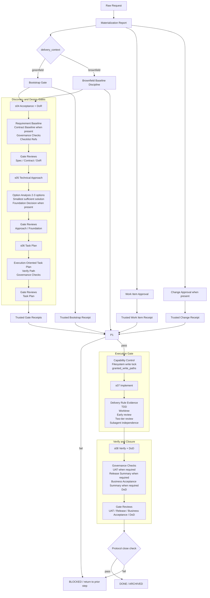

# Workflow Rule-Checklist Alignment

> Vietnamese: workflow-rule-checklist-alignment.vi.md

This document reviews how `rule`, `checklist`, `approval gate`, `protocol`, and `validator` support one another in the current workflow.

Goals:

- answer whether the current workflow is tight enough
- point out where the layers reinforce each other well, and where there is still tension or a gap
- provide a flowchart and an interpretation table so the team reads the same semantics

Cross-reference date: `2026-04-20`.

## Quick Verdict

Current assessment:

- `rule` and `checklist` reinforce each other noticeably better than before
- no remaining `hard conflict` is seen between `spec/design before code`, `human-controlled gates`, `greenfield hard stop`, `brownfield baseline`, `TDD`, `worktree`, `review`, and `DoD`
- the strongest part today is the chain `hard rule -> source-of-truth artifact -> gate review -> validator/protocol`
- the remaining weakness is not in principle but in a few places where `semantics` or `coverage` are not yet fully closed
- after the latest tightening pass, an additional invariant blocks contradictory status blocks, such as still reporting `ACTIVE` or `Next Human Action: NONE` while `Missing Gates` is present

Assessment by layer:

| Layer | Status | Short note |
|---|---|---|
| Backbone `s01-s08` | Good | step contract, gates, and handoff are clearer than before |
| Human approval model | Good | `approval_gates`, `role_signoffs`, `gate_reviews`, and trusted signed receipts align |
| Governance checklist | Good | checklists are not standalone; they attach to `s04`, `s06`, `s08` |
| SDD | Good | `spec`, `contract`, `foundation`, `spec-change`, and `spec-coverage` have clear roles |
| Execution guardrails `s07` | Good | `Delivery Rule Evidence` now pairs with capability control to lock the implementation path before `ACTIVE + s07` |
| Protocol semantics | Good | hard-block is stronger and `activate` now defaults to aligning with the `s07` execution gate |
| Repo sample coverage | Fair | fixtures and smoke are good, but the repo commit does not yet contain a real protocol-managed work item to serve as a canonical sample |

## How The Layers Reinforce Each Other

| Layer | Main role | Reinforces which layer | Does not replace |
|---|---|---|---|
| `hard rule` | defines what is forbidden or what must hold | checklist, gate, validator | actual evidence |
| `step contract` | pins the goal, input, output, and done criteria of each step | hard rule, traceability | human approval |
| `checklist_refs` + `Governance Checks` | forces structured review by profile | `DoR`, `Task Plan`, `DoD`, exception handling | gate signoff |
| `approval_gates` | declares which gate is `required` or `not_applicable` | governance validator | authority and review timestamp |
| `role_signoffs` | declares which role has signoff authority | `gate_reviews`, authority model | evidence that a review happened |
| `gate_reviews` | records the actual reviewer and review time | approval gate, audit trail | authority responsibility |
| `trusted signed receipt` | proof outside the project root to seal human approval at `work-item`, `change`, and workflow gate | protocol execution gate | authority map in the note |
| `protocol approval` | blocks state transition at the work item/change level | step note gates | quality of the step content |
| `Delivery Rule Evidence` | forces `s07` to record evidence for TDD/worktree/review/delegation | verify and governance | `DoD` |
| `capability control` | locks write permission on the implementation path at the filesystem level until the protocol opens `ACTIVE + s07 + granted_write_paths` | protocol execution gate | trusted human approval |
| `validator` | performs mechanical and minimal semantic checks | all of the above | deep business review |

## Flowchart

## Detail Table By Step

| Step | Main rule | Supporting checklist/evidence | Human gate | What validator/protocol blocks | Assessment |
|---|---|---|---|---|---|
| `materialization` | do not open a new item casually; `greenfield` must have bootstrap logic | materialization report, dedup, change strategy | work item approval, change approval when present | no `ACTIVE` without the corresponding trusted receipt | Good |
| `s04` | `Spec`, `Contract`, `DoR` must pass before design/implement | `Requirement Baseline`, `Contract Baseline`, `Governance Checks`, checklist profile | `Spec`, `Contract`, `DoR` | governance validator forces signoff + review metadata; protocol only trusts a gate when a trusted receipt is present and matches the artifact | Good |
| `s05` | brainstorming with discipline; choose the smallest sufficient solution | `Option Analysis`, `Foundation Decision`, `Brownfield Impact Analysis` when needed | `Approach`, `Foundation` when applicable | governance validator forces `2-3` options and a gate review | Good |
| `s06` | task plan must be execution-oriented | `Verification Path`, dependency, checkpoint, governance checks | `Task Plan` | protocol refuses `ACTIVE` without `s06` evidence | Good |
| `s07` | `TDD`, `worktree`, early review, two-tier review, subagent only for independent tasks | `Delivery Rule Evidence`, `granted_write_paths`, capability control, implementation notes, exception/spec-change when present | no final gate closure at this step | governance validator forces structured evidence; protocol + capability control open the implementation path only at `ACTIVE + s07` | Good |
| `s08` | no premature done declaration; branch/worktree closed only after verify | `Governance Checks`, `Spec Coverage`, `UAT`, `Release Summary`, `Business Acceptance Summary`, `DoD` | `UAT`, `Release`, `Business Acceptance`, `DoD` when required | protocol refuses `DONE` if `s08` gates are insufficient | Good |

## Consistency Guard

- The router status block must now be semantically consistent:
  - if `Missing Gates` differs from `NONE`, `Workflow Status` must not be `ACTIVE`, `READY_FOR_REVIEW`, or `VERIFIED`
  - if `Missing Gates` differs from `NONE`, `Next Human Action` must not be `NONE`
- The regression smoke now includes a greenfield case `QR Voucher + voucher service API + tone brand` to ensure a raw feature request in an empty repo only stops at the `proposal stage`.

## Detail Table By Rule And Checklist

| Concern | Hard rule | Accompanying checklist/evidence | Reinforcement result |
|---|---|---|---|
| code too early | `spec/design before code` | `Requirement Baseline`, `Contract Baseline`, `DoR`, `Task Plan`, `gate_reviews` | the rule forbids; the checklist explains why coding is not yet allowed |
| gut-feel approach | `brainstorming with discipline` | `Option Analysis`, `recommended_option`, `trade_offs` | the checklist creates a comparison surface for human review |
| over-engineering | `smallest sufficient solution` | `Option Analysis`, `Brownfield Impact Analysis`, `Foundation Decision` | forces justification when choosing a larger path |
| vague task plan | `planning execution-oriented` | `Main Artifact` at `s06`, `verify path`, dependency, checkpoint | turns planning into real execution input |
| behavior change without guard | `TDD for behavior change` | `Delivery Rule Evidence.tdd_*` | the rule and evidence block attach directly to `s07` |
| high-risk change done in a shared workspace | `worktree for large or risky change` | `Delivery Rule Evidence.worktree_*` | the rule determines when it is needed; the evidence proves it was handled |
| review deferred to the end | `early review, not deferred to the end` | `review_status`, `review_refs` | forces review to occur during implementation |
| review correct on code but wrong on spec | `two-tier review` | `spec_compliance_status`, `code_quality_status` | separates, in the correct order, spec-correctness from code-cleanliness |
| subagent abuse | `subagent only for independent tasks` | `independence_status`, `merge_path`, `verify_path` | turns delegation into something conditional, not a preference |
| agent bypasses the protocol and edits files directly | `ACTIVE + s07 + granted_write_paths` are required to open the implementation path for writing | `capability control`, `write-root`, protocol report | enforcement is no longer only after-the-fact at the validator |
| closing an item too early | `no premature done declaration` | `DoD`, `UAT/Release/Business Acceptance`, `gate_reviews` | a review pass or a local test pass is not enough to close |

## Where Reinforcement Is Strong

The rule clusters that reinforce each other best:

1. `Spec/Contract/DoR` + `checklist_refs` + `gate_reviews`
   - The rule sets the condition.
   - The checklist creates a structured inspection surface.
   - The gate review turns it into a human-passed decision with an audit trail.

2. `Approach` + `Option Analysis` + `Foundation Decision`
   - No longer just "you must brainstorm."
   - There is now a concrete output for a human to choose or reject.

3. `Task Plan` + protocol `ACTIVE`
   - This is the strongest tightening point after the recent pass.
   - `s06` is no longer just a doc; it is a real protocol gate.

4. `human gate metadata` + `trusted signed receipts`
   - `gate_reviews` and `role_signoffs` remain the source-of-truth semantics in the note.
   - The trusted receipt is the proof that lets the protocol open the gate.

5. `s07` execution rules + `Delivery Rule Evidence`
   - Previously the `s07` rules were correct in principle but weak in enforcement.
   - They now have their own evidence block and capability control locks the write path, so drift is harder if an agent jumps straight into implementation.

5. `s08` + `approval_gates`
   - `DoD`, `UAT`, `Release`, and `Business Acceptance` are now clearly separated in role.
   - This reduces confusion between technical verification and business/release signoff.

## Remaining Conflict Or Tension

I currently do not see a `hard conflict` of the form "this rule forces A while that rule forces not-A".

What remains is `tension` or a `coverage gap`:

| Severity | Issue | Why it is not yet perfect | Recommended status |
|---|---|---|---|---|
| Medium | capability control is still a user-space filesystem policy | if the agent runtime allows a free shell with the same OS user, the agent could in theory bypass it via a system command outside the workflow CLI | a host/runtime-level command policy is needed to block chmod or direct edit outside the protocol |
| Low | the repo does not yet contain a canonical protocol-managed work item in `work-items/` | the protocol validator passes on fixtures/smoke, but the repo commit is mostly a legacy-skipped item | add one standard protocol-managed sample work item afterward |
| Low | inheritance between `governance_profile` and `checklist_refs` is implicit logic, not always traceable in each note | this is intentional to avoid repeating refs, but new readers may think the checklist is missing | keep as-is, but docs should explain this more clearly during onboarding |

## What Is No Longer A Conflict

| Topic | Current status |
|---|---|
| `work item approval` vs `bootstrap gate` | no conflict; `bootstrap gate` is a project/context-level gate, `work item approval` is an item-level gate |
| `role_signoffs` vs `gate_reviews` | no conflict; one is the authority map, the other is the actual reviewer audit trail |
| `governance checklist` vs `approval gates` | no conflict; the checklist answers "what was checked", the gate answers "who passed what" |
| `UAT` vs `DoD` | no conflict; `UAT` is a scope acceptance gate, `DoD` is the overall closure gate |
| `Foundation Decision` vs `brownfield minimal delta` | no conflict; `brownfield` opens `foundation` only when an architectural boundary is touched |
| `early review` vs `s08 verify` | no conflict; `s07` review catches issues early, `s08` remains the final conclusion |

## Recommendations If You Want To Tighten Further

If you want it tighter after this pass, the order should be:

1. commit a sample `protocol-managed work item` into the repo so docs, status, and the validator all look at the same standard
2. add a unified report of the `workflow gate summary` kind to view all `approval_gates`, `gate_reviews`, `governance_status`, and `protocol_status` at once
3. if you want deeper audit at `s07`, add a finalized sample note with a real `Delivery Rule Evidence` instead of relying only on fixtures

## Reference Sources

- [AGENTS.global.md](/Users/haonguyen87/Documents/workspaces/personal/projects/RnD-AI/Code-Factory/policies/codex/AGENTS.global.md:1)
- [SKILL.md](/Users/haonguyen87/Documents/workspaces/personal/projects/RnD-AI/Code-Factory/skills/orchestration/codex-workflow-chain/SKILL.md:1)
- [workflow-chain.md](/Users/haonguyen87/Documents/workspaces/personal/projects/RnD-AI/Code-Factory/skills/orchestration/codex-workflow-chain/references/workflow-chain.md:1)
- [workflow-human-review-gates.md](/Users/haonguyen87/Documents/workspaces/personal/projects/RnD-AI/Code-Factory/docs/workflow-human-review-gates.md:1)
- [workflow-keywords-glossary.md](/Users/haonguyen87/Documents/workspaces/personal/projects/RnD-AI/Code-Factory/docs/workflow-keywords-glossary.md:1)
- [work-item-materialization.md](/Users/haonguyen87/Documents/workspaces/personal/projects/RnD-AI/Code-Factory/skills/orchestration/codex-workflow-chain/references/work-item-materialization.md:1)
- [work-item-protocol.md](/Users/haonguyen87/Documents/workspaces/personal/projects/RnD-AI/Code-Factory/skills/orchestration/codex-workflow-chain/references/work-item-protocol.md:1)
- [project-context/README.md](/Users/haonguyen87/Documents/workspaces/personal/projects/RnD-AI/Code-Factory/project-context/README.md:1)
- [governance-decision-model.md](/Users/haonguyen87/Documents/workspaces/personal/projects/RnD-AI/Code-Factory/project-context/governance-decision-model.md:1)
- [governance-role-model.md](/Users/haonguyen87/Documents/workspaces/personal/projects/RnD-AI/Code-Factory/project-context/governance-role-model.md:1)