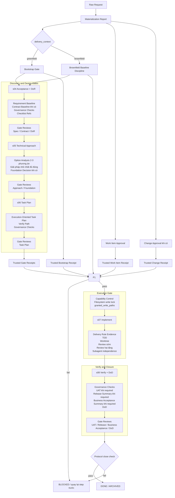

# Workflow Rule-Checklist Alignment

> Tiếng Anh / English: workflow-rule-checklist-alignment.md

Tài liệu này rà soát cách `rule`, `checklist`, `approval gate`, `protocol` và `validator` đang bổ trợ nhau trong workflow hiện tại.

Mục tiêu:

- trả lời workflow hiện tại đã chặt chưa
- chỉ ra chỗ nào là bổ trợ tốt, chỗ nào còn tension hoặc gap
- cung cấp flowchart và bảng diễn giải để team đọc cùng một ngữ nghĩa

Thời điểm đối chiếu: `2026-04-20`.

## Kết Luận Nhanh

Đánh giá hiện tại:

- `rule` và `checklist` nhìn chung đã bổ trợ nhau tốt hơn trước rõ rệt
- không còn thấy `hard conflict` lớn giữa `spec/design before code`, `human-controlled gates`, `greenfield hard stop`, `brownfield baseline`, `TDD`, `worktree`, `review`, `DoD`
- phần mạnh nhất hiện tại là chuỗi `rule cứng -> source-of-truth artifact -> gate review -> validator/protocol`
- phần còn yếu không nằm ở nguyên tắc, mà ở một vài chỗ `semantics` hoặc `coverage` chưa kín hoàn toàn
- sau đợt siết mới, đã có thêm invariant để chặn block trạng thái mâu thuẫn kiểu còn `Missing Gates` mà vẫn báo `ACTIVE` hoặc `Next Human Action: NONE`

Mức đánh giá:

| Lớp | Trạng thái | Nhận định ngắn |
|---|---|---|
| Backbone `s01-s08` | Tốt | step contract, gate và handoff đã rõ hơn trước |
| Human approval model | Tốt | `approval_gates`, `role_signoffs`, `gate_reviews` và trusted signed receipts đã khớp hơn |
| Governance checklist | Tốt | checklist không đứng riêng mà bám vào `s04`, `s06`, `s08` |
| SDD | Tốt | `spec`, `contract`, `foundation`, `spec-change`, `spec-coverage` đã có vai trò rõ |
| Execution guardrails `s07` | Tốt | `Delivery Rule Evidence` đã đi cùng capability control để khóa implementation path trước `ACTIVE + s07` |
| Protocol semantics | Tốt | hard-block đã mạnh hơn và `activate` mặc định đã khớp execution gate `s07` |
| Repo sample coverage | Trung bình | fixture và smoke tốt, nhưng repo commit hiện chưa có protocol-managed work item thật để xem như canonical sample |

## Cách Các Layer Bổ Trợ Nhau

| Layer | Vai trò chính | Bổ trợ cho layer nào | Không thay cho |
|---|---|---|---|
| `rule cứng` | định nghĩa điều bị cấm hoặc điều kiện phải có | checklist, gate, validator | evidence thực tế |
| `step contract` | khóa mục tiêu, input, output, done criteria của từng step | rule cứng, traceability | human approval |
| `checklist_refs` + `Governance Checks` | ép review có cấu trúc theo profile | `DoR`, `Task Plan`, `DoD`, exception handling | gate signoff |
| `approval_gates` | khai báo gate nào là `required` hay `not_applicable` | governance validator | authority và review timestamp |
| `role_signoffs` | khai báo role nào có authority signoff | `gate_reviews`, authority model | bằng chứng đã review |
| `gate_reviews` | ghi reviewer thực tế + thời điểm review | approval gate, audit trail | trách nhiệm authority |
| `trusted signed receipt` | proof ngoài project root để seal human approval ở `work-item`, `change` và workflow gate | protocol execution gate | authority map trong note |
| `protocol approval` | chặn state transition ở cấp work item/change | step note gates | quality của nội dung step |
| `Delivery Rule Evidence` | ép `s07` phải ghi evidence cho TDD/worktree/review/delegation | verify và governance | `DoD` |
| `capability control` | khóa quyền ghi implementation path ở mức filesystem cho tới khi protocol mở `ACTIVE + s07 + granted_write_paths` | protocol execution gate | trusted human approval |
| `validator` | kiểm cơ học và semantic tối thiểu | tất cả lớp trên | review nghiệp vụ sâu |

## Flowchart

## Bảng Chi Tiết Theo Step

| Step | Rule chính | Checklist/Evidence bổ trợ | Gate human | Validator/Protocol chặn gì | Đánh giá |
|---|---|---|---|---|---|
| `materialization` | không mở item mới tùy hứng; `greenfield` phải có bootstrap logic | materialization report, dedup, change strategy | work item approval, change approval khi có | không cho `ACTIVE` nếu chưa có trusted receipt tương ứng | Tốt |
| `s04` | `Spec`, `Contract`, `DoR` phải pass trước design/implement | `Requirement Baseline`, `Contract Baseline`, `Governance Checks`, checklist profile | `Spec`, `Contract`, `DoR` | governance validator buộc signoff + review metadata; protocol chỉ tin gate khi có trusted receipt còn khớp artifact | Tốt |
| `s05` | brainstorming có kỷ luật; chọn giải pháp nhỏ nhất đủ đúng | `Option Analysis`, `Foundation Decision`, `Brownfield Impact Analysis` khi cần | `Approach`, `Foundation` khi áp dụng | governance validator buộc `2-3` options và gate review | Tốt |
| `s06` | task plan phải execution-oriented | `Verification Path`, dependency, checkpoint, governance checks | `Task Plan` | protocol không cho `ACTIVE` nếu chưa có evidence `s06` | Tốt |
| `s07` | `TDD`, `worktree`, review sớm, review hai tầng, subagent chỉ cho task độc lập | `Delivery Rule Evidence`, `granted_write_paths`, capability control, implementation notes, exception/spec-change nếu có | không đóng gate cuối ở step này | governance validator buộc evidence có cấu trúc; protocol + capability control chỉ mở implementation path ở `ACTIVE + s07` | Tốt |
| `s08` | không tự tuyên bố done; branch/worktree chỉ chốt sau verify | `Governance Checks`, `Spec Coverage`, `UAT`, `Release Summary`, `Business Acceptance Summary`, `DoD` | `UAT`, `Release`, `Business Acceptance`, `DoD` khi required | protocol không cho `DONE` nếu gate `s08` chưa đủ | Tốt |

## Consistency Guard

- Block trạng thái router giờ phải nhất quán ngữ nghĩa:
  - nếu `Missing Gates` khác `NONE`, `Workflow Status` không được là `ACTIVE`, `READY_FOR_REVIEW` hoặc `VERIFIED`
  - nếu `Missing Gates` khác `NONE`, `Next Human Action` không được là `NONE`
- Regression smoke hiện có case greenfield `QR Voucher + voucher service API + tone brand` để bảo đảm raw feature request trong repo trống chỉ dừng ở `proposal stage`.

## Bảng Chi Tiết Theo Rule Và Checklist

| Concern | Rule cứng | Checklist/Evidence đi kèm | Kết quả bổ trợ |
|---|---|---|---|
| code quá sớm | `spec/design before code` | `Requirement Baseline`, `Contract Baseline`, `DoR`, `Task Plan`, `gate_reviews` | rule cấm, checklist giải thích vì sao chưa được code |
| chọn approach cảm tính | `brainstorming có kỷ luật` | `Option Analysis`, `recommended_option`, `trade_offs` | checklist tạo bề mặt so sánh để human review |
| over-engineer | `giải pháp nhỏ nhất đủ đúng` | `Option Analysis`, `Brownfield Impact Analysis`, `Foundation Decision` | buộc justify khi chọn đường lớn hơn |
| task plan mơ hồ | `planning execution-oriented` | `Artifact Chính` ở `s06`, `verify path`, dependency, checkpoint | chuyển planning thành input thực thi thật |
| behavior change không có guard | `TDD cho behavior change` | `Delivery Rule Evidence.tdd_*` | rule và evidence block gắn trực tiếp với `s07` |
| change risk cao nhưng làm chung workspace | `worktree cho change lớn hoặc rủi ro` | `Delivery Rule Evidence.worktree_*` | rule xác định khi nào cần, evidence chứng minh đã xử lý |
| review để cuối | `review sớm, không đợi cuối` | `review_status`, `review_refs` | ép review diễn ra trong implement |
| review đúng code nhưng sai spec | `review hai tầng` | `spec_compliance_status`, `code_quality_status` | tách đúng-thứ tự giữa đúng-spec và đẹp-code |
| lạm dụng subagent | `subagent chỉ cho task độc lập` | `independence_status`, `merge_path`, `verify_path` | biến delegation thành thứ có điều kiện, không phải preference |
| agent bypass protocol rồi sửa file trực tiếp | `ACTIVE + s07 + granted_write_paths` mới mở quyền ghi implementation path | `capability control`, `write-root`, protocol report | enforcement không còn chỉ dừng ở validator sau-the-fact |
| đóng item quá sớm | `không tự tuyên bố done` | `DoD`, `UAT/Release/Business Acceptance`, `gate_reviews` | review pass hay test pass cục bộ không đủ để đóng |

## Chỗ Đã Bổ Trợ Tốt

Các cụm rule đang bổ trợ tốt nhất:

1. `Spec/Contract/DoR` + `checklist_refs` + `gate_reviews`
   - Rule xác định điều kiện.
   - Checklist tạo mặt kiểm có cấu trúc.
   - Gate review biến nó thành quyết định human-pass có audit trail.

2. `Approach` + `Option Analysis` + `Foundation Decision`
   - Không còn chỉ nói “phải brainstorm”.
   - Giờ đã có output cụ thể để human chọn hoặc reject.

3. `Task Plan` + protocol `ACTIVE`
   - Đây là điểm siết tốt nhất sau đợt chỉnh vừa rồi.
   - `s06` không còn chỉ là doc; nó là gate thực sự của protocol.

4. `human gate metadata` + `trusted signed receipts`
   - `gate_reviews` và `role_signoffs` vẫn là source-of-truth semantic trong note.
   - trusted receipt mới là proof để protocol mở gate.

5. `s07` execution rules + `Delivery Rule Evidence`
   - Trước đây các rule ở `s07` rất đúng về nguyên tắc nhưng yếu ở enforcement.
   - Hiện tại chúng đã có block evidence riêng và capability control khóa write path, nên drift khó xảy ra hơn nếu agent đi thẳng vào implement.

5. `s08` + `approval_gates`
   - `DoD`, `UAT`, `Release`, `Business Acceptance` đã được tách rõ vai trò.
   - Điều này giảm nhầm lẫn giữa verify kỹ thuật và signoff business/release.

## Conflict Hoặc Tension Còn Lại

Hiện tại tôi không thấy `hard conflict` kiểu “rule này buộc A còn rule kia buộc not-A”.

Các điểm còn lại là `tension` hoặc `coverage gap`:

| Mức độ | Vấn đề | Vì sao chưa hoàn hảo | Trạng thái khuyến nghị |
|---|---|---|---|
| Medium | capability control vẫn là filesystem policy ở mức user-space | nếu runtime của agent cho phép shell tự do cùng quyền OS user, về lý thuyết agent vẫn có thể thử bypass bằng lệnh hệ thống ngoài workflow CLI | cần host/runtime-level command policy để chặn chmod hoặc direct edit ngoài protocol |
| Low | repo hiện chưa có protocol-managed work item canonical trong `work-items/` | validator protocol đang pass trên fixture/smoke, nhưng repo commit hiện chủ yếu là legacy-skipped item | nên thêm 1 sample protocol-managed work item chuẩn sau |
| Low | inheritance giữa `governance_profile` và `checklist_refs` là logic ngầm, không luôn trace đủ ở từng note | đây là chủ đích để tránh lặp ref, nhưng người đọc mới có thể tưởng checklist thiếu | giữ như hiện tại, nhưng doc nên giải thích rõ hơn khi onboarding |

## Những Gì Không Còn Là Conflict

| Chủ đề | Trạng thái hiện tại |
|---|---|
| `work item approval` vs `bootstrap gate` | không conflict; `bootstrap gate` là gate cấp project/context, `work item approval` là gate cấp item |
| `role_signoffs` vs `gate_reviews` | không conflict; một bên là authority map, một bên là audit trail reviewer thực tế |
| `governance checklist` vs `approval gates` | không conflict; checklist trả lời “đã kiểm gì”, gate trả lời “ai pass gì” |
| `UAT` vs `DoD` | không conflict; `UAT` là acceptance gate theo scope, `DoD` là closure gate tổng |
| `Foundation Decision` vs `brownfield minimal delta` | không conflict; `brownfield` chỉ mở `foundation` khi chạm baseline kiến trúc |
| `review sớm` vs `s08 verify` | không conflict; `s07` review để bắt lỗi sớm, `s08` vẫn là nơi kết luận cuối |

## Khuyến Nghị Nếu Muốn Siết Thêm

Nếu muốn chặt hơn nữa sau đợt này, thứ tự nên là:

1. commit một `protocol-managed work item` mẫu vào repo để docs, status và validator nhìn cùng một chuẩn
2. thêm một báo cáo hợp nhất kiểu `workflow gate summary` để nhìn một lần ra toàn bộ `approval_gates`, `gate_reviews`, `governance_status`, `protocol_status`
3. nếu muốn audit sâu hơn ở `s07`, bổ sung thêm sample note finalized có `Delivery Rule Evidence` thật thay vì chỉ dựa vào fixture

## Nguồn Đối Chiếu

- [AGENTS.global.md](../policies/codex/AGENTS.global.md)
- [SKILL.md](../skills/orchestration/codex-workflow-chain/SKILL.md)
- [workflow-chain.md](../skills/orchestration/codex-workflow-chain/references/workflow-chain.md)
- [workflow-human-review-gates.md](workflow-human-review-gates.md)
- [workflow-keywords-glossary.md](workflow-keywords-glossary.md)
- [work-item-materialization.md](../skills/orchestration/codex-workflow-chain/references/work-item-materialization.md)
- [work-item-protocol.md](../skills/orchestration/codex-workflow-chain/references/work-item-protocol.md)
- [project-context/README.md](../project-context/README.md)
- [governance-decision-model.md](../project-context/governance-decision-model.md)
- [governance-role-model.md](../project-context/governance-role-model.md)
