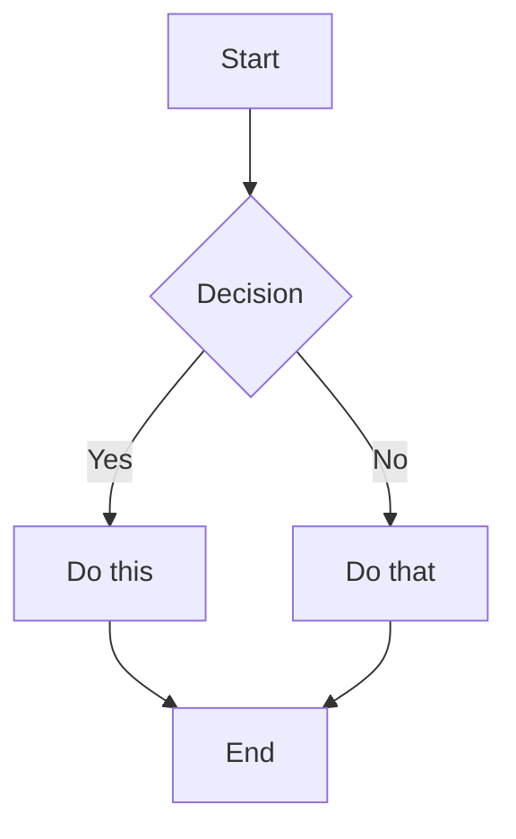
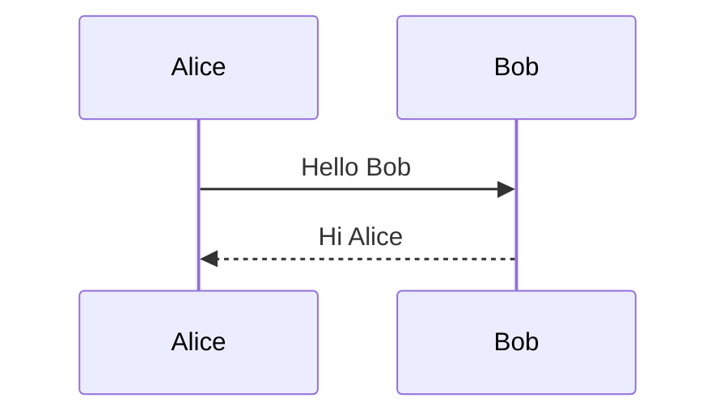
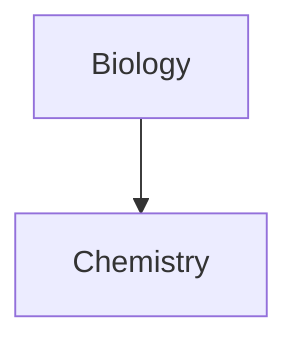
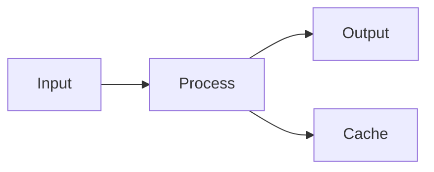

# Diagrams, Footnotes, HTML, And A Complete Example


Lower-frequency Obsidian Flavored Markdown syntax: Mermaid diagrams, footnotes, raw HTML, and one fully worked example note. See the main `SKILL.md` for everyday syntax (formatting, links, embeds, callouts, lists, tables, properties, tags).

## Diagrams (Mermaid)

````markdown

````

### Sequence Diagrams

````markdown

````

### Linking In Diagrams

````markdown

````

## Footnotes

```markdown
This sentence has a footnote[^1].

[^1]: This is the footnote content.

You can also use named footnotes[^note].

[^note]: Named footnotes still appear as numbers.

Inline footnotes are also supported.^[This is an inline footnote.]
```

## HTML Content

Obsidian supports HTML within Markdown:

```markdown
<div class="custom-container">
  <span style="color: red;">Colored text</span>
</div>

<details>
  <summary>Click to expand</summary>
  Hidden content here.
</details>

<kbd>Ctrl</kbd> + <kbd>C</kbd>
```

## Complete Example

````markdown
---
title: Project Alpha
date: 2024-01-15
tags:
  - project
  - active
status: in-progress
priority: high
---

# Project Alpha

## Overview

This project aims to [[improve workflow]] using modern techniques.

> [!important] Key Deadline
> The first milestone is due on ==January 30th==.

## Tasks

- [x] Initial planning
- [x] Resource allocation
- [ ] Development phase
  - [ ] Backend implementation
  - [ ] Frontend design
- [ ] Testing
- [ ] Deployment

## Technical Notes

The main algorithm uses the formula $O(n \log n)$ for sorting.

```python
def process_data(items):
    return sorted(items, key=lambda x: x.priority)
```

## Architecture



## Related Documents

- ![[Meeting Notes 2024-01-10#Decisions]]
- [[Budget Allocation|Budget]]
- [[Team Members]]

## References

For more details, see the official documentation[^1].

[^1]: https://example.com/docs

%%
Internal notes:
- Review with team on Friday
- Consider alternative approaches
%%
````
